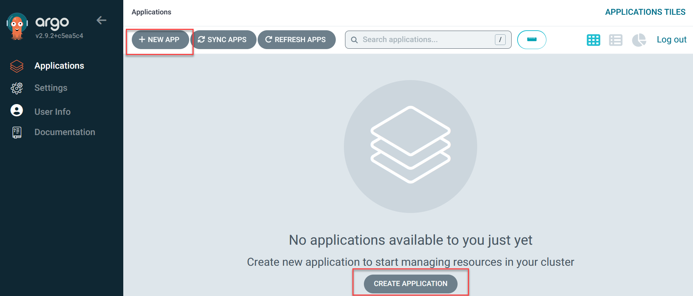
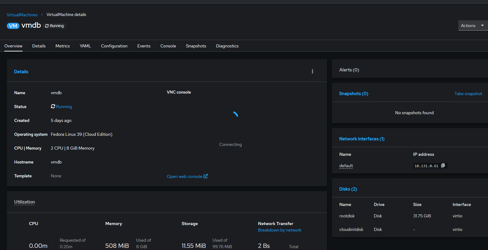

# Platform Engineering Immersion Lab Documentation
### Include Disclaimer of experience needed

---

### Platform Engineering

Platform Engineering attempts to bring a standardization to the deployment of applications across a hybrid/multi-cloud infrastructure in an automated environment by creating a defined Internal Development Platform (IDP). Platform Engineering attempts to treat infrastructure and operations as a product to support the standard IDP.
</br>

## Lab Walkthrough.

- [Platform Engineering Immersion Lab Documentation](#platform-engineering-immersion-lab-documentation)
    - [Include Disclaimer of experience needed](#include-disclaimer-of-experience-needed)
    - [Platform Engineering](#platform-engineering)
  - [Lab Walkthrough.](#lab-walkthrough)
  - [Overview and Setup:](#overview-and-setup)
  - [What is required for labs](#what-is-required-for-labs)
  - [Lab configuration and Login](#lab-configuration-and-login)
    - [Step 1 - Login into the Openshift Console environment:](#step-1---login-into-the-openshift-console-environment)
    - [Step 2 - Login into the Jumphost:](#step-2---login-into-the-jumphost)
    - [Step 3 - Login into the Immersion Day environment:](#step-3---login-into-the-immersion-day-environment)
    - [Step 4 - Setup GitHub repository:](#step-4---setup-github-repository)
  - [Part 1 : Deploy](#part-1--deploy)
    - [Lab 1: Create Webby Application:](#lab-1-create-webby-application)
    - [Lab 2: Deploy application using ArgoCD](#lab-2-deploy-application-using-argocd)
      - [Deploying in the ArgoCD Console.](#deploying-in-the-argocd-console)
      - [Alternative: Create ArgoCD deployment file.](#alternative-create-argocd-deployment-file)
    - [Explore the deployed application (OpenShift Console, ArgoCD) ](#explore-the-deployed-application-openshift-console-argocd-)
      - [ArgoCD Overview.](#argocd-overview)
      - [Let's return to the Openshift Console tab.](#lets-return-to-the-openshift-console-tab)
    - [Lab 2: Deploy Virtual Machine:](#lab-2-deploy-virtual-machine)
    - [Lab 2.2: Deploy in ArgoCD](#lab-22-deploy-in-argocd)
  - [Openshift Console](#openshift-console)
  - [Part 2: Updates , Logs \& Deletion ](#part-2-updates--logs--deletion-)
    - [Explore logs, how to determine version of application, and some basic operations tasks.](#explore-logs-how-to-determine-version-of-application-and-some-basic-operations-tasks)
      - [\*\* Repo Update Overview\*\*](#-repo-update-overview)
      - [**Logs Overview**.](#logs-overview)
      - [ArgoCD App Destroy](#argocd-app-destroy)


## <span style="color:green"><b>Overview and Setup:</span></b>

## What is required for labs

- Public Git Repo
  - Using Github or Gitlab, create a public repository to store your files.
- Web Browser
- Optional:
  - `oc` command installed locally on your machine.
  - `git` command installed locally on your machine.
  - Local code editor like Visual Studio Code.

## Lab configuration and Login

- **OCP AWS Cluster web console**: https://console-openshift-console.apps.ocp4.mysidlabs.com
- **OCP On-Prem Cluster web console**: https://console-openshift-console.apps.ocp-hpe02.pedemo.ignw.io


Each user is assigned a user id pedemo-<class_id>-user<id_number_assigned_in_class> (ex. pedemo-2abc-user5). Please use this id when logging in.

Each user has a private jump box configured to allow participants console access to the OCP cluster. This can be accessed through the Red Hat Openshift Console. It does not have ssh access.

Follow the steps below to access the lab environment:

### Step 1 - Login into the Openshift Console environment:

1. Login to RHOS Console :
   
   1.1. Select demoauth and login with your demo credentials
   
   1.2. We are now in the Openshift Console.
   


### Step 2 - Login into the Jumphost:

**Note:** If you have the optional tools installed on your local machine, these below steps are not needed to successfully complete the labs. Feel free to go through them to get familiar with a portion of vm management though.

Your environment has been provisioned with a jump host with all necessary tools already installed. You can access this through the Openshift console you just logged into.

  1. Begin by selecting your environment in the upper left corner next to the Red Hat Openshift logo. (Change from "All Clusters" to "local-cluster".)
  2. Select **Virtualization** in the left menu. Then select **VirtualMachines**.
  3. Ensure your user's project is selected in the upper left corner. (eg. Project: pedemo-2abc-user5)
  4. Select the VM "jump" by clicking on it's name.
  5. In the middle of the screen, select **Open web console**. This will open a web console in a new tab.
  6. Click in the console window and use the following credentials to login:
  - Username: **cloud-user**
  - Password: **d3pl0y**


### Step 3 - Login into the Immersion Day environment:

From either the console of the jump server or your own machine, run the following:

`oc login api.ocp-hpe02.pedemo.ignw.io:6443 -u pedemo-2abc-user5`

```
pedemo150@jump:~$ oc login api.ocp4.mysidlabs.com:6443 -u pedemo-2abc-user5
The server uses a certificate signed by an unknown authority.
You can bypass the certificate check, but any data you send to the server could be intercepted by others.
Use insecure connections? (y/n): y
```

> **Info**: Enter `y` to accept the use of an insecure connection

```
Authentication required for https://api.ocp4.mysidlabs.com:6443 (openshift)
Username: pedemo-2abc-user5
Password:
Login successful.

Welcome! See 'oc help' to get started.
```

> **Info**: Use the password provided by your lab instructor to authenticate when prompted.

To see your currently logged in user and validate that you successfully authenticated, run:

`oc whoami`

```
pedemo150@jump:~$ oc whoami
pedemo150
```

### Step 4 - Setup GitHub repository:

In our final step, we need to create a public git repository. You are welcome to use any publically accessible git repository for this. For the purposes of our labs today, we will be using GitHub. 

1. Login to [GitHub](https://www.github.com). If you don't have a GitHub account, you will need to create one. 
2. If this is a new account, you will need to add a ssh key into your account for authentication purposes. You can do this [here](https://github.com/settings/keys). For our purposes, if you are using the jump server, you can create an ssh key by running the following command on the jump server and accepting all defaults. 

        ssh-keygen

    You will find the newly created ssh public key using the following command:

        cat ~/.ssh/id_rsa.pub

3. Create a new GitHub Repo. You can do this by following this [link](https://github.com/new). Fill out the form as follows:
  * Repository Name: Name this something unique and memorable to you (eg. jsmith-peid-2024)
  * Description: Can leave blank
  * Public/Private: Make sure this is set as public
  * Add a README file: Leave unchecked
  * Add .gitignore: Leave .gitignore template set to None
  * Choose a license: Leave as None
  * Click _Create repository_ 
  * This will create your repository and take you to it's main page. Please leave this window open so you can reference it later.

You have now completed the lab enviroment configuration!

## <span style="color:green"><b>Part 1 : Deploy</span></b>

### <span style="color:gray"><b>Lab 1: Create Webby Application:</span></b>

1. From either the jump host or your own machine, create the container-deploy.yaml.
   This file will contain 6 resources to deploy our application.

- NOTE: Make sure to change the namespace in each resource to your choice of username or unique identifier  
   

      ```bash
      nano container-deploy.yaml
      ```

    1. First we will create the gitlab-pull-secret resource. This resource will allow our container to pull the application code from its gitlab repository.

        ```yaml
        ---
        kind: Secret
        apiVersion: v1
        metadata:
          name: gitlab-pull-secret
          namespace: <INPUT NAMESPACE HERE>
        type: kubernetes.io/dockerconfigjson
        data:
          .dockerconfigjson: eyJhdXRocyI6eyJyZWdpc3RyeS5naXRsYWIuY29tIjp7InVzZXJuYW1lIjoicGVkZW1vaWQiLCJwYXNzd29yZCI6ImdsZHQtaFY1aUt5Zzh5Q0FRUGp5NC1mVmEiLCJlbWFpbCI6InBlaWRAY2R3LmNvbSIsImF1dGgiOiJjR1ZrWlcxdmFXUTZaMnhrZEMxb1ZqVnBTM2xuT0hsRFFWRlFhbmswTFdaV1lRPT0ifX19

        ```

    2. Copy the webby Deployment resource into your container-deploy.yaml.

        ```yaml
        ---
        apiVersion: apps/v1
        kind: Deployment
        metadata:
          name: webby
          namespace: <INPUT NAMESPACE HERE>
        spec:
          replicas: 3
          selector:
            matchLabels:
              app: webby
          template:
            metadata:
              labels:
                app: webby
            spec:
              terminationGracePeriodSeconds: 10
              containers:
              - name: webby
                image: registry.gitlab.com/ignw1/dvs-code/pedemo/rhos-pe-immersion-day/webby:v1.1
                imagePullPolicy: Always
                env:
                  - name: NAMESPACE
                    value: "<INPUT NAMESPACE HERE>"
                resources:
                  requests:
                    cpu: 100m
                    memory: 64Mi
                  limits:
                    cpu: 200m
                    memory: 128Mi
              imagePullSecrets:
                - name: gitlab-pull-secret
        ```

        _Code Breakdown_

        This Deployment resource will create 3 pods running our webby application.

        

        It will use the image from the gitlab repository we added in the image field above. It will use the secret we created above to allow the container to pull the application code when it starts.
        Resources requests and limits for the containers that will be created are set in the container sections as well.

        

    3. Create webby Service resource:

        ```yaml
        ---
        apiVersion: v1
        kind: Service
        metadata:
          name: webby-service
          namespace: <INPUT NAMESPACE HERE>
        spec:
          type: ClusterIP
          selector:
            app: webby
          ports:
            - port: 80
              targetPort: 9999
        ```

        _Code Breakdown_

        This service resource allows pods to communicate with each other within our cluster. It will use the _selector.app_ to connect to the application label _webby_.

        

    4. Create webby Route resource:

        ```yaml
        ---
        apiVersion: route.openshift.io/v1
        kind: Route
        metadata:
          name: webby
          namespace: <INPUT NAMESPACE HERE>
        spec:
          tls:
            termination: edge
            insecureEdgeTerminationPolicy: Redirect
          to:
            kind: Service
            name: webby-service
            weight: 100
          wildcardPolicy: None
        ```

    5. Add condb deployment resource into the container-deploy.yaml file:

        ```yaml
        ---
        apiVersion: apps/v1
        kind: Deployment
        metadata:
          name: condb
          namespace: <INPUT NAMESPACE HERE>
        spec:
          selector:
            matchLabels:
              app: condb
          template:
            metadata:
              labels:
                app: condb
            spec:
              terminationGracePeriodSeconds: 10
              containers:
              - name: condb
                image: registry.gitlab.com/ignw1/dvs-code/pedemo/rhos-pe-immersion-day/condb:v1.1
                imagePullPolicy: Always
                
                resources:
                  requests:
                    cpu: 200m
                    memory: 128Mi
                  limits:
                    cpu: 400m
                    memory: 256Mi
              imagePullSecrets:
                - name: gitlab-pull-secret
        ```

        _Code Breakdown_

        This condb resource follows the same framework as the webby deployment resource above.It does use a different container image.
        

        _Don't forget to change the namespace to match the prior resources_

    6. Finally, add the condb service resource:

        ```yaml
        ---
        apiVersion: v1
        kind: Service
        metadata:
          name: condb-service
          namespace: <INPUT NAMESPACE HERE>
        spec:
          selector:
            app: condb
          ports:
            - port: 8888
              targetPort: 8888
        ```

        _Don't forget to change the namespace to match the prior resources_

    7. Add your code into your Github repository and push it. Run the following from the same directory you created the 

        ```bash
        git init
        git remote add origin git@github.com:<your GitHub username>/<your GitHub repo name>.git
        git branch -M main
        git add -A
        git commit -am "Initial commit"
        git push -u origin main
        ```

### <span style="color:gray"><b>Lab 2: Deploy application using ArgoCD</span></b>

There are two ways to deploy our application, creating an ArgoCD file that holds our application deployment and using the ArgoCD Console.

#### Deploying in the ArgoCD Console.

1. To access the ArgoCD Console go to the Openshift Console and select the hamburger menu in the upper right corner. This will open the ArgoCD Console in another tab.

    

2. Select the Cluster ArgoCD. This will take you to ArgoCD Login. Select LOGIN VIA OPENSHIFT

    

3. Re-enter your username and password into the demoauth login.

4. Now we are logged into the ArgoCD Console. Let's select NEW APP in the left hand corner or CREATE APPLICATION.

    

    1. General Section:

        1.  Here we will name our application as it will appear in Argo

        2.  Set the Project Name to *default*. This is the project that ArgoCD is set to manage, not the project Openshift will manage.

        3.  Set Sync Policy to Automatic and check *prune resouces* and *self heal*

        4.  Select Auto-Create Namespace.

            

    2. Source Section:

        1. Set the repository url to your public repository that has your container-deploy.yaml file.

        2.  Make sure to put a period in the Path section.

            

    3. Destination section:

        1. In Cluster URL we can change which Openshift cluster we want to deploy in.
        We are deploying in <CLUSTER_URL>

            

        2. After the Cluster URL is selected, you will enter the Openshift Namespace the application will deploy in. (eg. pedemo-2abc-user5)

            

    4. Then click Create.

#### Alternative: Create ArgoCD deployment file.

We can also start the ArgoCD deploy from a file and add it to ArgoCD console.

```yaml
apiVersion: argoproj.io/v1alpha1
kind: Application
metadata:
  name: gitops-webby
  namespace: openshift-gitops
spec:
  destination:
    server: https://api.ocp-hpe02.pedemo.ignw.io:6443 1
  project: default
  source:
    directory:
      include: container-deploy.yaml 2
      jsonnet: {}
    path: .
    repoURL: https://github.com/<INPUT YOUR PUBLIC REPO NAME HERE>.git 3
    targetRevision: HEAD
  syncPolicy:
    automated:
      prune: true
      selfHeal: true
    syncOptions:
      - CreateNamespace=false
```

1. Change the destination server to either On-Prem () or AWS Cluster ().
2. Make sure the source directory points to your correct container-deploy.yaml in your public repo.
3. Set the repoURL to your public repo
4. Click Create.

Now the webby application is deployed!

### <span style="color:green"><b>Explore the deployed application (OpenShift Console, ArgoCD) </span></b>

Now that the webby application is deployed we can review the resources that have been deployed and created.

#### ArgoCD Overview.


1. Applications Overview

   Once our application is deployed in Argo it has its own UI for visualizing application deployments and resources.
   Argo CD allows us to continuously sync manifests from Git to Openshift

   For example, here you can view the latest sync to the connected Git Branch
   

   From the overview in the upper right corner we can change the view from tree to pods, networking and list.
   

2. Settings

   Within Settings we can configure access for git repositories and keys, as well as what clusters and Argo projects to deploy applications into.
   

3. User Info
   1. This tab shows the current user and access.


#### Let's return to the Openshift Console tab.

1. Home Overview

2. Project Overview:
   This page provides an overview of your project. It includes labels, metrics and deployed inventory. Since ArgoCD manages the resources for the application we can delete resources here and Argo will detect the discepancy with the code and relaunch the resource.  
   

3. Workloads Overview:

   1. Pods
      The current pods that we have deployed are here.

   

   2. Deployments
      Deployments manage our pods and the number of pods we should have.


4. Networking Overview:

   1. Routes
      Routes are a resource that allows us to host our application at a public-facing URL.

      

      Clicking on the route url here will take us to our webby application.

      

      We can view the container backend from here and the VM backend will be avalaible later in the lab.
   2. Services
      Services are assigned an IP address and port pair that, when accessed, proxy to an appropriate backing pod. They don't allow public access.
      

5. Storage Overview:
   1. PersistentVolumeClaims: 
      The PersistentVolumeClaims section gives access to storage that is allocated permanently (or persistently.)
   2. StorageClaims:
      The StorageClaim resource object describes and classifies storage that can be requested by pods within the cluster.
   3. Volume Snapshots: 
      
6. CLI Overview:
   In the jumphost we can use the `oc` command to view our application resources.
  1. Make sure you are in the project that the webby application is deployed in. We will use `oc project <Namespace>` command will change the active project.
  2. `oc get pods` will show all pods in the current project.

   

  3. `oc get all` will show all resources in the current project. We have pods, deployments that control the pods, routes, and services listed.

   

  4. `oc get route` will show the created routes that host the application
  5. `oc get services`
  
  

  6. `oc describe pods` will show an in-depth description of all pods, including labels and pod status. 
   
  


---
### <span style="color:gray"><b>Lab 2: Deploy Virtual Machine:</span></b>

Using the Openshift Virtualization Operator we can deploy and manage Virtual Machines in Openshift.
Let's get started below!

1. In your jumphost create a file called vm-deploy.yaml.

    ```bash
    vi vm-deploy.yaml
    ```

2. Create the Virtual Machine resource

    ```yaml
    ---
    apiVersion: kubevirt.io/v1
    kind: VirtualMachine
    metadata:
      labels:
        app: vmdb 
      name: vmdb
      namespace: <INPUT NAMESPACE HERE>
    spec:
      dataVolumeTemplates:
      - apiVersion: cdi.kubevirt.io/v1beta1
        kind: DataVolume
        metadata:
          name: vmdb
        spec:
          sourceRef:
            kind: DataSource
            name: fedora
            namespace: openshift-virtualization-os-images
          storage:
            resources:
              requests:
                storage: 30Gi
      running: true
      template:
        metadata:
          labels:
            kubevirt.io/domain: vmdb
            app: vmdb
        spec:
          domain:
            cpu:
              cores: 1
              sockets: 2
              threads: 1
            devices:
              disks:
              - disk:
                  bus: virtio
                name: rootdisk
              - disk:
                  bus: virtio
                name: cloudinitdisk
              interfaces:
              - masquerade: {}
                name: default
              rng: {}
            features:
              smm:
                enabled: true
            firmware:
              bootloader:
                efi: {}
            resources:
              requests:
                memory: 8Gi
          evictionStrategy: LiveMigrate
          networks:
          - name: default
            pod: {}
          volumes:
          - dataVolume:
              name: vmdb
            name: rootdisk
          - cloudInitNoCloud:
              # NOTE: key below derived from "cat startup-script.sh | base64 -w0"
              userDataBase64: IyEvYmluL2Jhc2gKc3VkbyBhZGR1c2VyIC1VIC1tIGNsb3VkLXVzZXIKZWNobyAiY2xvdWQtdXNlcjpkM3BsMHkiIHwgY2hwYXNzd2QKc3VkbyB1c2VybW9kIC1hRyB3aGVlbCBjbG91ZC11c2VyCnN1ZG8gZG5mIHVwZGF0ZQpzdWRvIGRuZiBncm91cGluc3RhbGwgIkRldmVsb3BlciBUb29scyIgLXkKc3VkbyBkbmYgaW5zdGFsbCBweXRob24zLXBpcCAteQpzdWRvIGRuZiBpbnN0YWxsIGdpdC1hbGwgLXkKd2FpdApzdWRvIGdpdCBjbG9uZSBodHRwczovL2RlcGxveS11c2VyOmZTaDllenRzVnNhN0RjNW14dHRSQGdpdGxhYi5jb20vaWdudzEvZHZzLWNvZGUvcGVkZW1vL3Job3MtYXdzLXBlZGVtby5naXQKY2QgLi9yaG9zLWF3cy1wZWRlbW8vZGVtby1jb250YWluZXJzCnN1ZG8gY2htb2QgNzU1IC1SICoKcGlwMyBpbnN0YWxsIC1yIHJlcXVpcmVtZW50cy50eHQKcHl0aG9uMyAuL2RiLnB5Cg==
            name: cloudinitdisk
    ```

    _Code Breakdown pt.1_

    

    1. Add your namespace for your git repo here

    This section has the labels that our virtual machines will be deployed in.
    Underneath spec: the configuration for the virtual machine is set

    2. The spec section contains the configuration for the virtual machine. Specifically, sourceRef is where the virtual machine image is being pulled. The image we are using is located in openshift-virtualization-os-images namespace.
    3. The storage/resources/requests/storage block is where the default storage size for the virtual machine is set.

    _Code Breakdown pt.2_

    

    1. The settings and configuration for your vm is set here.
    2. The evictionStrategy: LiveMigrate is set to ensure that a virtual machine instance is not interrupted if the Openshift node is placed into maintenance or drained. Virtual Machines with this eviction strategy will be live migrated to another Openshift node.

        

    1. The cloudInitNoCloud.userDataBase64 is the base64 encoded startup script that does initial setup and configuration of the vm.

2.2 Create the Service Resource

```yaml
---
apiVersion: v1
kind: Service
metadata:
  name: vmdb-service
  namespace: <INPUT NAMESPACE HERE>
spec:
  selector:
    app: vmdb
  ports:
    - port: 8888
      targetPort: 8888
```

_Code Breakdown_
The service resource will allow our vm to communicate within the cluster.
**Don't forget to add your git repo**

### <span style="color:gray"><b>Lab 2.2: Deploy in ArgoCD</span></b>

Once your code is uploaded to your git repo, we can deploy our virtual machine with the same process we used in webby.

2.3 Upload code to your git repo
ion.

2.4 ArgoCD Console Deploy

2.4.2 ArgoCD File

Within the argoCD file make sure to change the git repo to your public repository AND change the directory to point to your vm-deploy.yaml/

```yaml
apiVersion: argoproj.io/v1alpha1
kind: Application
metadata:
  name: gitops-webby
  namespace: openshift-gitops
spec:
  destination:
    server: https://api.ocp-hpe02.pedemo.ignw.io:6443
  project: default
  source:
    directory:
      include: vm-deploy.yaml
      jsonnet: {}
    path: .
    repoURL: https://github.com/<INPUT YOUR PUBLIC REPO NAME HERE>.git
    targetRevision: HEAD
  syncPolicy:
    automated:
      prune: true
      selfHeal: true
    syncOptions:
      - CreateNamespace=false
```

2.4.3 The Virtual Machine Creation

Now we have a virtual machine managed by ArgoCD.
Now in the Openshift Console we can explore the Virtualization tab.

## Openshift Console

1. Virtualization Overview

Within the Virtualization , we want to go to the VirtualMachines tab. Here we can see our all the virtual machines that we've created in our project.

Go ahead and select **vmdb**.


1.  Details

This will take us to in-depth details about the machine, such as its status, utilization and pending alerts.


In the top right corner there is the Actions tab, where you can stop,restart,pause,clone and migrate machines.


1.  Configuration
    Configuration tab is where changes to Disks, Network Interfaces. Changing the configuration will be pending until the machine is restarted.
    

2.  Console
    To access the console of the virtual machine, click on the console tab.
    

## <span style="color:green"><b>Part 2: Updates , Logs & Deletion </span></b>

### Explore logs, how to determine version of application, and some basic operations tasks.

#### ** Repo Update Overview**

Within ArgoCD , we can view the changes made within the public git repo and if needed rollback to another version.
Note: Doing so will turn off auto-sync.
Within our public repository in the container deploy yaml let's edit the cpu requests from 100m to 50m.


Once the file is saved and commited Argo will detect the change in the git repo. We can then go into the history and rollback tab and select the older version.


Argo will then rollback to the older version and the App Diff button will avalable. Now you can compare the differences in code from Argo.

#### **Logs Overview**.

Within ArgoCD, the logs for the application are also avalable.

1. Select the webby deployment within the application tree.
   

2. When selected, go to the 3rd tab and select _Logs_
   

3. Now we can see the container logs directly from ArgoCD instead of changing to Openshift.

#### ArgoCD App Destroy

1. When we want to delete the webby or vm application, we will go to and select the delete tab.
   

2. Then type in the appliation name to verify deletion
   

3. Then the application is deleted!
